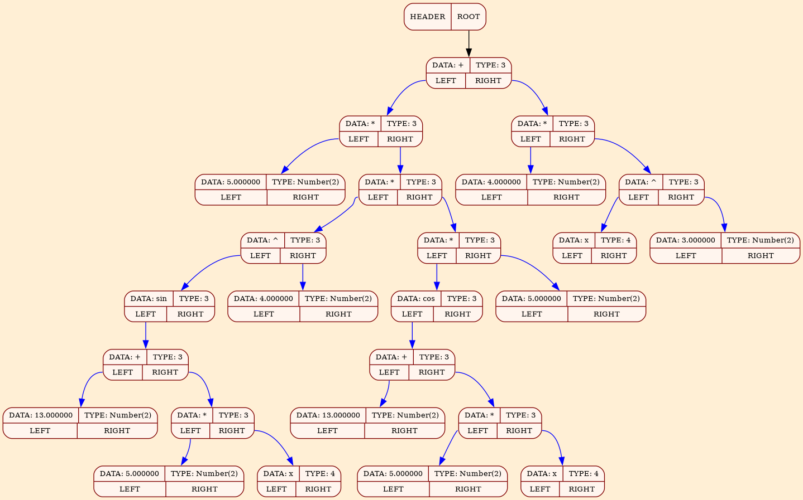
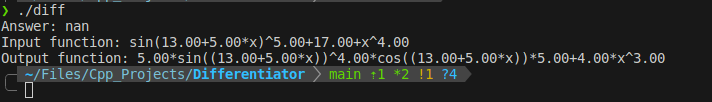

# Дифференциатор

Эта программа может дифференцировать математические выражения, считанные из файла. Также выдавать подробный отсчёт в виде Latex текста.
Текст отсчёта выглядит, как пошаговое доказательство какой-то теоремы, но при этом каждый пункт - это этап дифференцирования.

## Скачивание и установка

### Скачивание

В первую очередь нужно выполнить клонирование репозитория на свой компьютер выполнив следующую команду:

``` bash
git clone --recurse-submodules https://github.com/dmitry131131/SIMD_project.git
```

### Сборка

Для сборки программы выполните команду: 
```bash
make
```

## Реализация парсера

Парсер представляет собой простой алгоритм рекурсивного спуска, который предусматривает ввод чисел, знаков `+`, `-`, `*`, `\`, `^`, `sin`, `cos`.
Результатом работы алгоритма является бинарное дерево, графическое представление которого имеет вид:



Данный дамп реализуется с помощью библиотеки `graphviz`.

## Реализация оптимизаций дерева

В этом проекте реализованы простейшие оптимизации:
+ свёртка константных выражений
+ упрощение математических формул

Например выражение: `12 + 2 * 5` на этапе оптимизации дерева будет вычислено как `22` и помещено в дерево на место исходного выражения.
Также выражения содержащие сложение выражения с `0`, умножение на `0` или на `1` также будут оптимизированы.
Исходный код этих оптимизаций можно увидеть в файле [Simplify.cpp](/src/Simplify.cpp)

## Пример работы

В качестве примера возьмём производную функции `(sin(13+5*x))^5 + 17 + x^4`.

Программа не может вычислить результат этого выражения, потому что в нём присутствуют переменные, затем программа печатает исходное выражение, а затем выражение после дифференцирования.



Результат взятия производной можно легко проверить на правильность взяв производную самостоятельно.

Также программа генерирует текст в Latex, который соответствует следующему [pdf документу](/img/Report.pdf):

Как можно увидеть текст не выходит за пределы документа и отсчёт о дифференцировании можно читать.